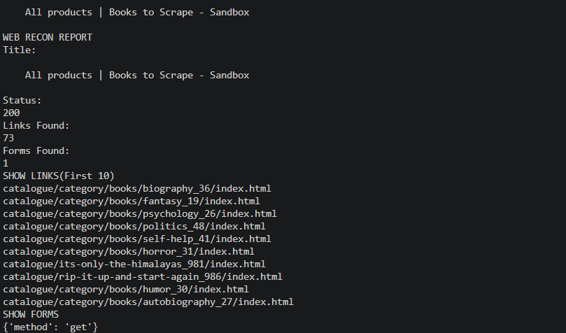

# WebRecon-Lite

A lightweight Python web reconnaissance tool for crawling websites, extracting information, and generating simple reconnaissance reports.

## Features

* HTTP GET requests
* Extract page title
* Extract HTTP status code
* Extract response headers
* Extract links from HTML pages
* Remove duplicate links
* Extract form information (action, method)
* Generate terminal-based recon reports

## Technologies

* Python 3
* Requests
* BeautifulSoup4
* lxml

## Example Usage

```bash
 python main.py -t https://books.toscrape.com
```

## Planned Features

* JavaScript file discovery
* Email extraction
* JSON report export
* TXT report export
* Recursive crawling
* API endpoint discovery

## Disclaimer

This project is intended for educational and authorized security testing purposes only.
